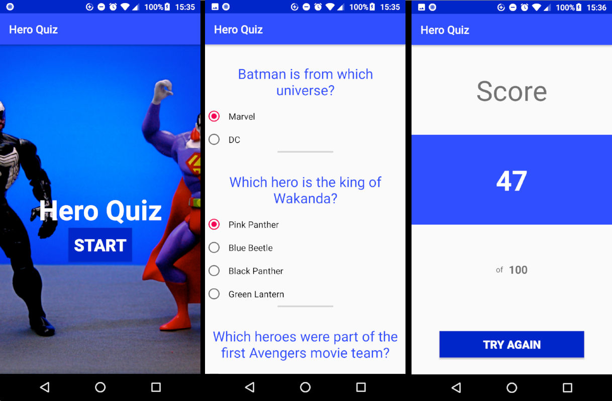
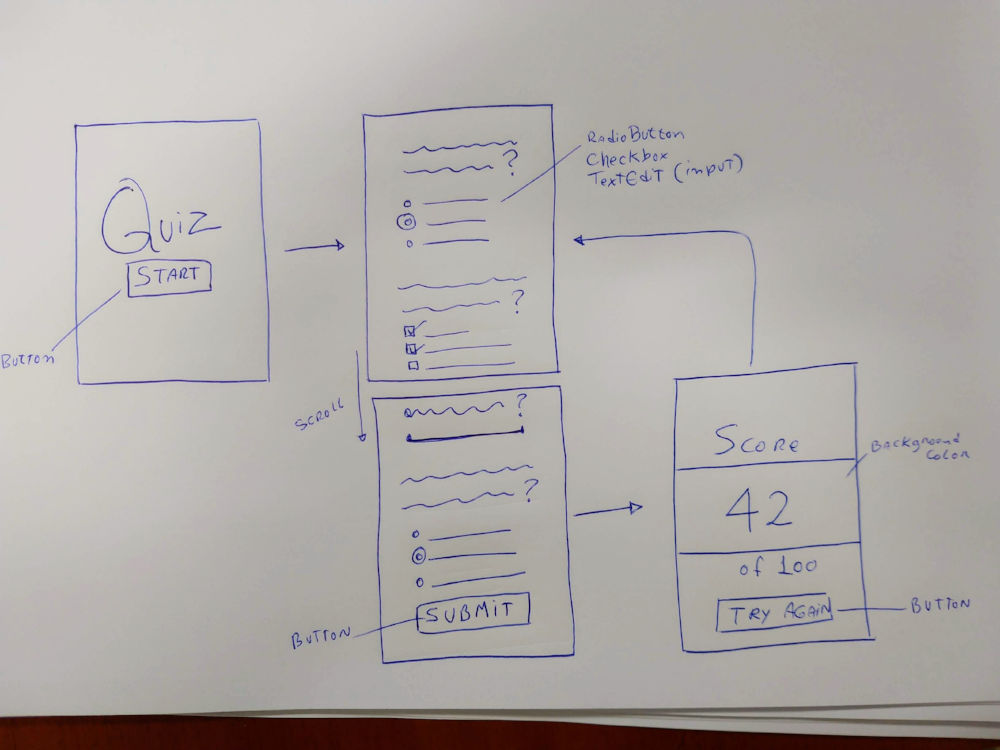

# Hero Quiz (Android App)

> Android app for Udacity: Android Basics Nanodegree

## Description
Quiz with 10 questions about superheroes

## Translations
* English (en-EN)
* Brazilian Portuguese (pt-BR)

## Screenshots

## Wireframe

## Tested on
* OS: Ubuntu
* IDE: Android Studio 3.2
* Device: Motorola Moto G6 Plus
* Android: 8.0.0 Oreo

## Resources
Image background and icon:
* [Venom vs. Bizarro](https://www.flickr.com/photos/jdhancock/4332013224/)
  * [JD Hancock](https://www.flickr.com/photos/jdhancock/)
    * [Licenced under Creative Commons 2.0](https://creativecommons.org/licenses/by/2.0/)

## Meta
Front-End Developer: [Jonimar Marques Policarpo](http://linkedin.com/treedbox 'LinkEdin')

Twitter: [@treedbox](http://twitter.com/treedbox)

E-mail: [treedbox@gmail.com](mailto:treedbox@gmail.com)

Site: [treedbox](http://treedbox.com)

## License
[MIT](LICENSE.md) © [TreedBox](https://github.com/treedbox)

[https://github.com/treedbox/HeroQuizUdacityAndroidBasics](https://github.com/treedbox/HeroQuizUdacityAndroidBasics)
